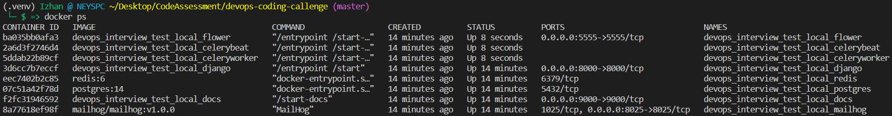
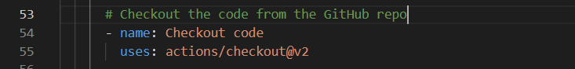

# CODE ASSESSMENT IZHAN HERNÁNDEZ

## Decisions/Steps:

- Forked the main repo into `izhanhernandez/devops-coding-callenge.git`
- Generated a local Docker environment for the Django repository with `docker compose -f local.yml up -d`
  
- Changed `local.yml` to `docker-compose.yml` for commodity
- Checked that the app was responsive and functional:
  
- Decided to use GitHub Actions for simplicity since both the original repo and my fork are both in GitHub and the integration will be faster and easier
- Created a `build-and-deploy.yml` GitHub Actions file to define the actions pipeline with the following steps:
  - First we configure the environment
    
  - We choose Discord as the notification channel but any other communication tool would work too (Slack, Teams...). The hyperlink in the message redirects to the GitHub Actions build to see all the step reports and console outputs
    
  - The notifications look like this (yellow for pipeline start, green for success and red for pipeline failure):
    
  - Checkout and download the code from the repo:
    
  - Build and push both the Django (which image also serves the Celeryworker, Celerybeat and Flower services) and the Docs images:
    
  - Notify again the end of the pipeline
    
- The next step is to merge into the repo with `git add *` `git commit -um "add github actions pipeline"` and `git push origin/master`
- In order to create the Action using the embedded IDE of GitHub makes the job easier and gives the option to use the integrated functions from the marketplace:
  

## Deployment/Suggestion:

- In order to deploy there are multiple options, specially since we are using a Docker Image registry to upload images. Once the images are uploaded to an accessible registry, deploying, uploading, rollbacking those images is quite easy to do. Some examples:
  - An AWS EC2 server where we have the same `docker-compose.yml` file present in the root of this repo, we can restart the compose stack re-pulling the newest images
  - We can also run the app in a ECS (Elastic Container Service) deployment, using either the same EC2 virtual machines or even auto-managed Fargate serverless instances
  - We could go one step forward and use a Kubernetes deployment for our application, either in a self hosted server (or EC2...) or using a managed solution like EKS (Elastic Kubernetes Service) in AWS, OpenShift, GKS (Google Cloud solution)
  - We could also bet for simplicity and use Docker-Compose stack deployment solutions like Portainer
