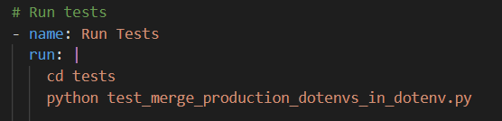
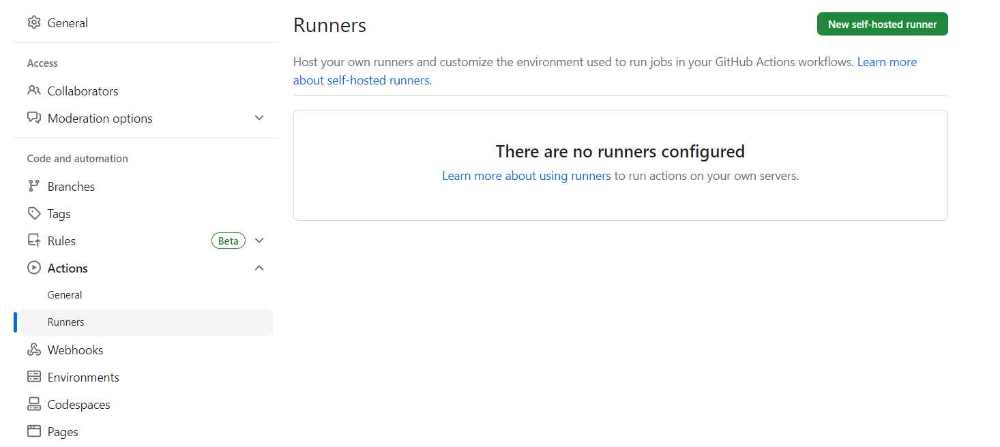

# CODE ASSESSMENT IZHAN HERNÁNDEZ

## Future actions:

- I would have also included a test phase with the tests in the folder `tests` but they seemed to be non functional. In any case it would have looked like this:
  
- To be able to run the pipelines it is also required a server to run it, and currently I don't have a self-hosted server available for it:
  
